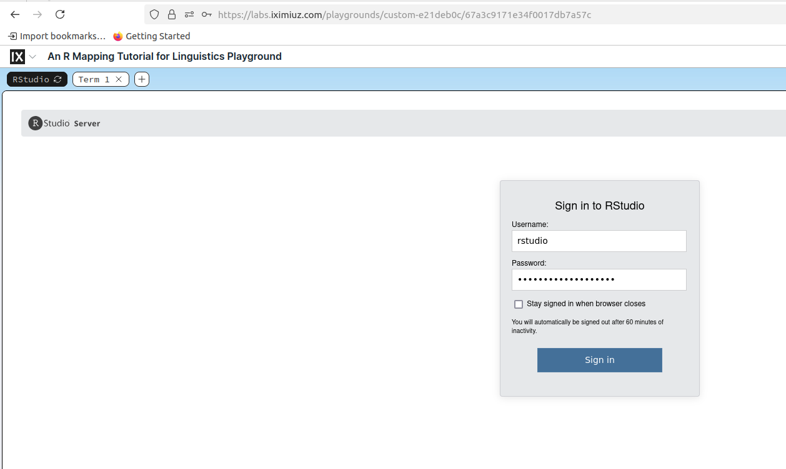
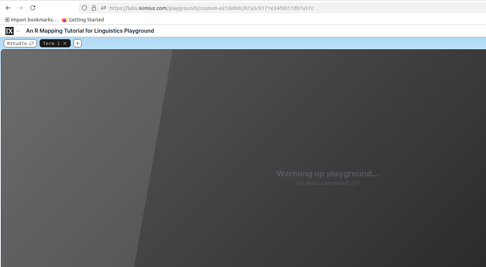
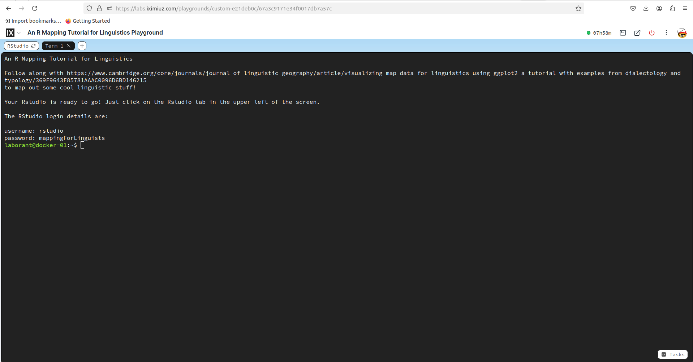
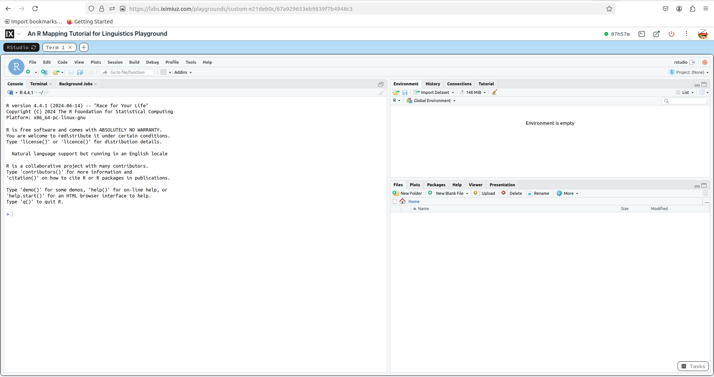

# mapping-for-linguists

In this repository we provide the data and code for the [paper](https://www.cambridge.org/core/journals/journal-of-linguistic-geography/article/visualizing-map-data-for-linguistics-using-ggplot2-a-tutorial-with-examples-from-dialectology-and-typology/369F9643F85781AAAC0096D6BD146215) "Visualizing map data for linguistics using ggplot2: A tutorial with examples from dialectology and typology". 

Citation:
Roemling, D., Winter, B., & Grieve, J. (2025). Visualizing map data for linguistics using ggplot2: A tutorial with examples from dialectology and typology. Journal of Linguistic Geography, 1–15. doi:10.1017/jlg.2024.11

Also thanks to Adam Leskis for improving the repo for this paper!


## Getting started

The main file you will need is the Mapping_Paper_Linguists.Rmd. This has all the code from the tutorial paper. You could, for example, open it in [R Studio](https://posit.co/download/rstudio-desktop/) and start working. An alternative for running the file is using a Docker environment (see below).


## Running locally

For running the docker way, you'll need docker installed. The easiest way to do this is with [Docker Desktop](https://www.docker.com/get-started/), but technically any platform that can build and run containers (like Rancher Desktop) will serve the same purpose.

First, build the container with:

```sh
docker build -t tutorial .
```

and then once that's finished building you can run it with

```sh
docker run -it --rm -p 127.0.0.1:8787:8787 -e PASSWORD=rstudio tutorial
```

> this will set the login password to "rstudio", and the default username will also be "rstudio".

After that's running, you should be able to open http://localhost:8787 in your browser and see the Rstudio login screen.




## Running the tutorial

If you don't feel like messing around with specific versions of R and dependencies, there's a fully configured playground at [labs.iximuz.com](https://labs.iximiuz.com/playgrounds/custom-e21deb0c) that you can use. All you need is a web browser!

> You'll need a GitHub username to log in, so if you don't have that, [sign up first](https://github.com/).

1. Navigate to https://labs.iximiuz.com/playgrounds/custom-e21deb0c and start the playground.

2. You'll probably need to wait for about 4-5 minutes for the system to get set up (it's pulling a container image, which is what takes the longest). Compared to fighting R dependencies, you might find this much faster/easier.



3. Once the terminal prompt shows up, You can click on the "Rstudio" tab.



4. You'll see the Rstudio login screen. The username is "rstudio" and the password is "mappingForLinguists" (case sensitive).


5. You'll then have a nice fresh Rstudio environment to use for the tutorial.



6. Follow the tutorial, and have fun!


## Reproducible environment 

Using the [renv](https://rstudio.github.io/renv/articles/renv.html) library, attached here is also the state of the current versions for all packages and R. To make use of this you will need the file project.Rproj, renv.lock and the folder renv. 
