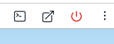
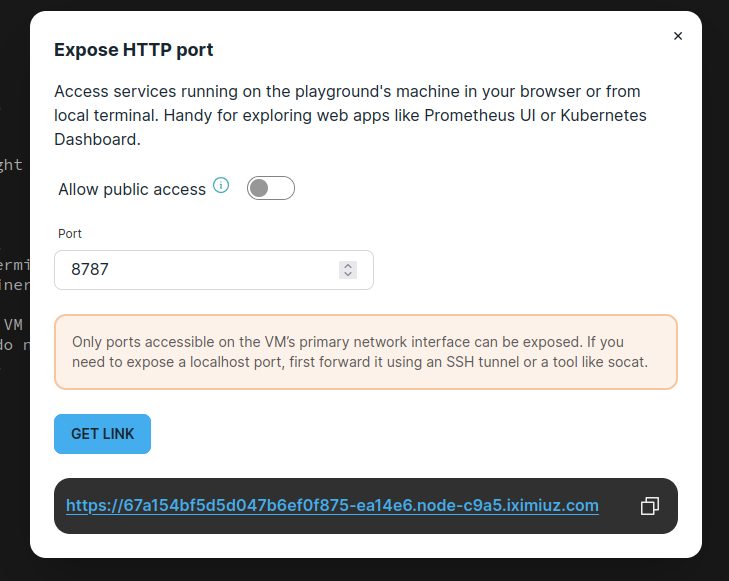
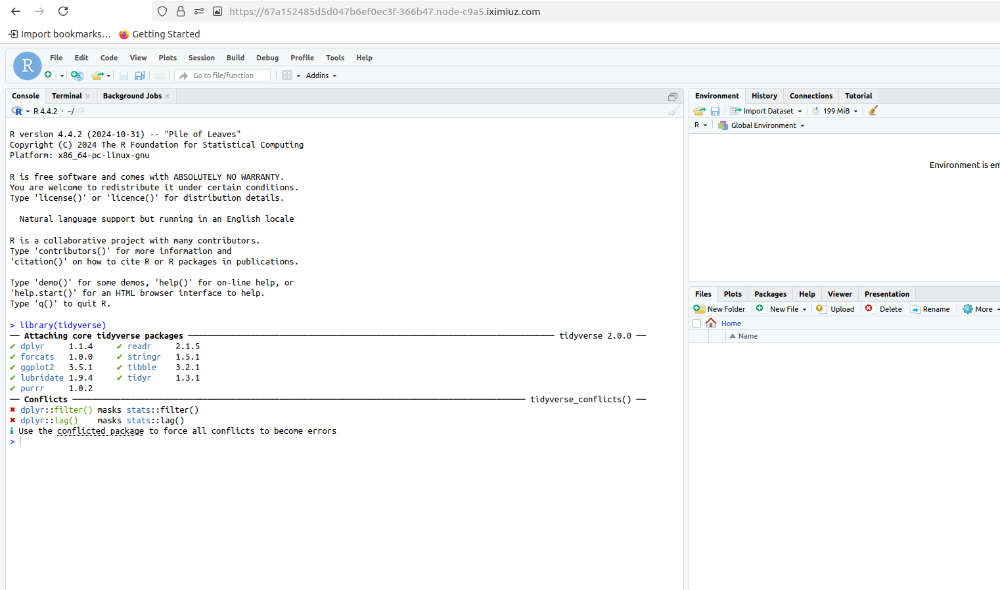

# mapping-for-linguists
In this repository we provide the data and code for the paper "Visualizing map data for linguistics using ggplot2: A tutorial with examples from dialectology and typology". 

## Running the tutorial

If you don't feel like messing around with specific versions of R and dependencies, there's a fully configured playgroun at [labs.iximuz.com](https://labs.iximiuz.com/playgrounds/custom-e21deb0c) that you can use. All you need is a web browser!

> You'll need a GitHub username to log in, so if you don't have that, [sign up first](https://github.com/).

1. Navigate to https://labs.iximiuz.com/playgrounds/custom-e21deb0c and start the playground.

2. You'll probably need to wait for about 4-5 minutes for the system to get set up (it's pulling a container image, which is what takes the longest). Compared to fighting R dependencies, you might find this much faster/easier.

3. Once the terminal prompt shows up, just click the button in the upper right that has an arrow popping up and to the right (that's the button to expose a port).

4. When the dialogue window opens up, enter 8787 into the window and click to generate a link.

4. Click on the link and a new window will open up to log into Rstudio. The username is "rstudio" and the password is "rstudio".

5. Follow the tutorial, and have fun!
